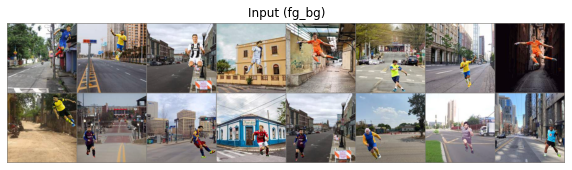
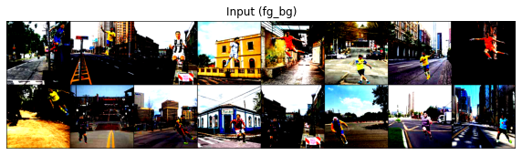
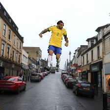
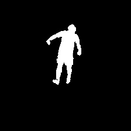
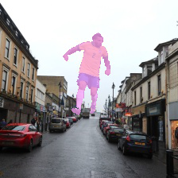

# Mask-and-Depth-Prediction
The problem comes under the domain of single class semantic segmentation (mask) and supervised depth estimation (depth). Here, I present my entire journey of how I approached the problem, starting from the data creation. 

I will explain every thing in detail but let's look at the results first:

<p align="center">
  
  
  
  
  
  
</p>

```
On Train set:
Mask:  Average Evaluation loss(BCEWithLogits Loss): 0.0106	 Average Metric(IOU):       0.9369
Depth: Average Evaluation loss(L1 Loss):            0.0592	 Average Metric(RMS Error): 0.8572
```

```
On Validation set: 
Mask:  Average Evaluation loss(BCEWithLogits Loss): 0.0106	 Average Metric(IOU):       0.9368
Depth: Average Evaluation loss(L1 Loss):            0.0595	 Average Metric(RMS Error): 0.8616
```

Note: The Intersection over Union (IoU) metric, also referred to as the Jaccard index, is essentially a method to quantify the percent overlap between the target mask and our prediction output. So the value of 1 is the best value for IOU whereas RMSE (Root Mean Squared Error) is an error rate, and hence, 0 defines the bast value in this case.

## Dataset
The one used in the project is a custom dataset that I have created. Please refer <a href = 'https://github.com/akshatjaipuria/Mask-and-Depth-Prediction/tree/master/data#about-the-data'>`this`</a> for details regarding the data creation.
Some of the samples from the dataset:
> bg

> fg

> fg_mask

> fg_bg

> fg_bg_mask

> fg_bg_depth


## What am I supposed to end up with?
My model is supposed to take two images, backgroung(bg) and fg_bg, as inputs at once. The output should be the mask, which is the segmented footballer in the fg_bg and the depth map of the fg_bg. The images are of dimension 224x224, both for imputs and outputs.

<p align="center">
  
</p>

We will unveil the magic slowly.

## Data Loader
The very first step is how we load data to train the model. Since it's a custom dataset, the dataloder had to be written according to my folder structure. The images that are to be loaded include bg, fg_bg, mask and depths. This <a href="https://github.com/akshatjaipuria/Mask-and-Depth-Prediction/blob/master/model/data_loader.py" target="_blank">`File`</a> can be referred for the code.

On a brief note, I use the PIL library to load the images. We have 100 bg, 400k fg_bg, 400k masks and 400k depth. Onle one bg images corresponds to 4000 images from each of the other categories. Instead of making copies of bg, I decided to play with the index to make that work with 100 images only 😆. The images are in such order that fg_bg, mask and depth from index 0-3999, 4000-7999, 8000-11999 ... correspond to bg at index 0, 1, 2, ... respectively. A simple solution is to chnage the bg index as:
```Python
bg_index = int(index / 4000)
```
#### Train set and Validation set
- Training size: 70% of 400k, i.e. 280k
- Validation size: 30% of 400k, i.e. 120k

The split is made using simple array slicing (numpy) of the list of paths and seed was set to avoid data mixup in train and validation sets.

To speed up, I used pin memory, num_morkers in dataloader as 4 (this reduced the loading time for each epoch by ~400s on Nvidia Tesla P100). Also, to speed up training, I kept the batch size as large as possible, given the GPU capacity.

## Model
Next comes the model architecture. Initially, I built some fully convolutional networks to experiment. Those were the usual linear CNN architectures, with the sequence of Conv, BN, ReLU repeatedly with some skip connections to get various receptive fields at the end of the model.

<p align="center">
  
</p>

But is this the correct way?

Here are some probable issues:
- It is computationally too expensive to mantain the same clannel dimmension throughout the layers.
- We need a full resolution output from the model and not just the class activations.
- This type of model learns the content of the images easily, but what we require is the spatial information (location) to be preserved.

Going through some of the blogs and contents online, I realised that Encoder-Decoder Model is a better and popular approach for this task. You can refer <a href="http://cs231n.stanford.edu/slides/2017/cs231n_2017_lecture11.pdf" target="_blank">`this`</a> for a brief overview. In this, we downsample the spatial resolution of the input, developing lower-resolution feature mappings which are learned to be highly efficient at discriminating between classes, and then upsample the feature representations into a full-resolution segmentation map. Same works well for depth maps too.

<p align="center">
  
</p>

One of the popular Encoder-Decoder Models is <a href="https://arxiv.org/pdf/1505.04597.pdf" target="_blank">`UNet`</a>. It has been improved over time with BN and an alternate upsampling (using 'bilinear' instead of Transpose Convolution). The image below presents the original architecture. But the <a href="https://github.com/qubvel/segmentation_models.pytorch#encoders-" target="_blank">`Encoder`</a> can be replaced with the State of the art models to achieve better results, which also depends on the complexity of the dataset.

<p align="center">
  
</p>

Now, for the model I am using, I have two seperate problems to solve (mask and depth). The image size in the original model was 572x572 and ours is 224x224. Keeping this in mind, the channels' size would become too small at the end of the encoder (as we would be training at 112 before 224) and the fact that if we keep the model size smaller, we would be able to train with larger batch sizes. Also, colab gives limited GPU, so it wasn't good enough to waste resources, I removed one of the encoder and one corresponding decoder layers to have a proper balance over all the constraints. And replacement of encoder with SOTA models was demanding a high increment of parameters count. The dataset not being very complex, I went with the default encoder only.

Since we had two seperate output requirements which are very different w.r.t the information they carry, I tried having seperate final decoder layers but that didn't help because mask and depth require same initial information from the images, but what they carry till the end is totally different. Therefor, I made the encoder part common and had seperate decoders for both the outputs. Here is a high level representation of my model.

<p align="center">
  
</p>

My model contains `~ 6.2 M  (6,242,050) parameters`, of which the encoder part has ~2.2 M parameters and the two decoders have ~2 M parameters each. The code for the model is available <a href="https://github.com/akshatjaipuria/Mask-and-Depth-Prediction/blob/master/model/network_architecture.py" target="_blank">`here`</a>. The fact that we use 'bilinear' upsampling instead of transpose convolution in decoders has decreased the parameter count considerably. But we never train the entire 6.2 M parameters at once, how we train in parts will be explained in the coming sections.

## Training
This section is dedicated to the gradual understanding of how I trained my model. One of the silly but important mistakes I would like to highlight in the beginning. I am using <a href="https://albumentations.readthedocs.io/en/latest/" target="_blank">`Albumentations`</a> for transformations and for pytorch we need to convet images to Tensors. The ToTensorV2() function availabe dosent change the range of  pixel values 0-255 to 0-1, but ToTensor() does. In my case I was using the ToTensorV2() for mask that lead to bad results since all inputs pixel values were in range 0-1 (as they were being normalized) which I didn't figure out earlier and corrected later to get the expected outputs. That mistake also led to exploding loss values and thus gradients, ultimately leading to NaN. Let's get started.

### Optimization for better performance on GPU
One of the important parts of training is to take care of the optimization so that the time taken to train can be reduced. We have limited resources available on Google Colab in terms of GPU capacity, processing speed and the time for which we can use the GPU for free. This makes it crutial to optimize the code for efficient use of GPU. The things that have to be taken care of include:

#### 1. GPU Memory usage
The data we pass are in batches. Its highly recommended to use a maximum batch size that can be handled by GPU at once. This will increase the training speed. In my case, I could use a size of 128, training for images of size 112x112, and 32 when training for images of size 224x224. It's necessary to make a balance between the model parameters, as heavy models will allow lower batch sizes only given the limited GPU memory.

#### 2. Avoiding Memory leaks
Consider the following code, which has a precise memory leakage point:
```Python
avg_loss=0
for data, target in data_loader:
  # ...
  loss = loss_fn(output, target)
  loss.backward # gradient calculation
  avg_loss += loss
  # ...
avg_loss /= len(data_loader)
```
Here, avg_loss is accumulating history across the training loop, since loss is a differentiable variable with autograd history. This can be fixed by writing either `avg_loss += float(loss)` or `avg_loss += loss.item()` instead.

#### 3. Don’t hold onto temporary variables
If you assign a Tensor or Variable to a local, Python will not deallocate until the local goes out of scope. You can free this reference by using del x. Similarly, if you assign a Tensor or Variable to a member variable of an object, it will not deallocate until the object goes out of scope. You will get the best memory usage if you don’t hold onto temporaries you don’t need.

```Python
avg_loss=0
for data, target in data_loader:
  # ...
  fn_target = some_fn(target)
  loss = loss_fn(output, fn_target)
  loss.backward # gradient calculation
  avg_loss += loss.item()
  # ...
avg_loss /= len(data_loader)
```
Here, `fn_target` is alive, even if the loop ends, while avg_loss is being calculated or any operation is being performed. This is because its scope extrudes past the end of the loop. To free it earlier, `del fn_target` is supposed to be used. Either avoid using such variables or delete them after their use.

These are some of the important points to keep in mind. Notice that the more you save memory, the larger batch size can be used and hence faster training. I had timed my <a href="https://github.com/akshatjaipuria/Mask-and-Depth-Prediction/blob/master/train_timed.py" target="_blank">`training loop`</a> to get a better insight on the behaviour of my code and manage the speed and time accordingly. Following all these, I was able to reduce the train time considerabely.

With a batch size of 128 with input size 112x112, it took 1500s for a complete epoch of train and validation and with a batch size of 32 with input size 224x224, it took 4000s for a complete epoch of train and validation on Nvidia Tesla P100 available on colab. Also, I wanted to print outputs on tensorboard to display and visualize logs and images, but owing to the overhead time it took (Around 1000s extra each epoch), I decided to drop it.

### Augmentation
Albumentations is a fast and an amazing library for applying transformations in PyTorch. I used this library for trying various augmentation techniques. I tried color jitter, horizontal flip, RGB channel shift and their combinations. I observed that these do help in various problems, but the effictiveness depends on the model as well as the dataset being used. In my case, augmentations didn't contribute much to training and I did not notice a considerable increase in the model's performance. One of the reasons that comes out to be is my train data and validation data comes from the same distribution and the dataset size is large enough. The data is also not very complex, for example, the footballer images are all portrait, they aren't rotated, which could have required the use of rotation augmentation. This helps the model to have proper insight of validation data as well and I hardly noticed any overfitting as the loss and the metric value were highly similar for both the sets. Normalization helped in faster training though and I am using that without any other augmentation technique.

| Un-normalized Inputs | Normalized Inputs |
| :------------------: | :---------------: |
|  |  |

### Loss Functions
This section contains the description of the loss functions I tried and their observation.
#### 1. For Segmentation
What we are trying to solve here can be represented as:

| Input | Mask | Segmentation |
| :---: | :--: | :----------: |
|  |  |  |

##### BCEWithLogits Loss
This is the loss function that actually worked out to be the best one among what I tried. The loss convergence was fast enough in the initial epochs. The learning rate plays a vital role, and if not taken care of, would lead to complete black images as output. 

>The cross entropy loss evaluates the class predictions for each pixel vector individually and then averages over all pixels, we're essentially asserting equal learning to each pixel in the image. This can be a problem if your various classes have unbalanced representation in the image, as training can be dominated by the most prevalent class.

Since we had only onle class, this issue didn't really come up.
##### Other Loss Functions
- Dice Loss: As I read about the loss, it was a good loss function for segmentation but it turned out that the convergence of the loss is too difficult. Sometimes, dice loss gets stuck in a local optima and doesn't converge at all.

- SSIM Loss: This loss didn't work well too over the edges of the masked regions. I tried having mean reduction of each pixel and also a different variant of reduction after the loss was calculated for each pixel to get a scaler value as:

<p align="center">
  
</p>

But this loss function didn't work well for the case.
- L1 Loss: It's a linear pixel wise loss, and wasn't suited for this problem. Reason might be that consider 5% pixels to be of the white region and 95% black. If this classifies all as black, the error rate is still very low of around 5%.

#### 2. For Depth Estimation
What does it look like?
<p align="center">
  
  
  
</p>

##### L1 Loss
It's a criterion that measures the mean absolute error (MAE) between each element in the input and target. This simple regression loss turned out to be most effective experimentally and it also converges fast as compared to other loss functions. The thought was further backed up by the reasoning in this <a href="https://mcarvalho.ml/material/docs/2018/regression_losses_icip_2018.pdf" target="_blank">`paper`.</a>
> Most subsequent works which base training on pixel-wise regression, simply used standard regression losses like mean absolute (L1) and mean square (L2) to train their networks.

##### Other Loss Functions
- SSIM Loss: This was potentially one good alternate to L1 loss but the predictions really weren't upto the mark. The network did learn the different intensities in the depth map, but the extreme intensities like complete black or white pixels weren't essentially fixed well by this loss. 

<p align="center">
  
</p>

- Custom Loss: I tried the loss described in this <a href="https://arxiv.org/pdf/1812.11941.pdf" target="_blank">`paper`</a>, which is basically a combination of L1 + SSIM + Edge Gradients. This worked well too on the depths and the predictions were somewhat similar to that of L1 loss. The reason I didn't use this further was that it's convergence was slower as compared to L1.

- BCEWithLogits Loss: This loss wasn't a good suit for the depth estimation. The predictions didn't resemble the depth maps well.

### Training the Model
The model has been trained in 2 parts, and each part has been trained in two stages. The encoder part and one of the decoders were trained together for depth and then the concept of Transfer Learning was used to train another decoder for mask only. The reason behind training the encoder with depth was that the depth images require more features as compared to mask and hence training encoder with depth made it learn to extract better features from the inputs as compared to the other way round. I also verified this reasoning experimentally by training the encoder for mask and only the decoder for depth. Even after many epochs, the outputs weren't good as the encoder was incapable of extracting the accountable features from the inputs and the decoder had to work on whatever features were available. This is clearly visible in the outputs below:

<p align="center">
  
</p>
<p align="center">
  
</p>

SGD with Momentum has been used as the optimized for the entire training. The model weights were saved in between the epochs in the colab runtime and at the end of each epoch, were saved to the mounted Google Drive directly to keep the trained weights safe.

#### Training for Depth
As described earlier, for depth we will be training encolder and one of the decoders, keeping another one frozen. By frozen, I mean that we will keep `required_grad=False` for the parameters we don't want to train. The sript for training can be referred <a href="https://github.com/akshatjaipuria/Mask-and-Depth-Prediction/blob/master/train_depth.py" target="_blank">`here`</a>. The freezing is done on the go, so you can refer the training <a href="https://githubtocolab.com/akshatjaipuria/Mask-and-Depth-Prediction/blob/master/mask_and_depth_estimation.ipynb" target="_blank">`notebook`</a> for that. 

<p align="center">
  
</p>

To train the network faster, I divided the training into two stages. First, the model was trained with resized input of shape 112x112, which lead to faster training and larger batch size. For 112x112, the model was trained for total 3 epochs, 1 initial epoch with `lr=0.01` and the later 2 epochs with `lr=0.001`. After this, the model was trained for the original input size of 224x224, for another 3 epochs. It was trained for each epoch with lr value of 0.01, 0.001 and 0.0001 respectively in order.

<p align="center">
  
  
</p>

#### Training for Mask
For this training, I kept the Encoder and Decoder for depth frozen and trained the seprate decoder for mask, using the concept of Transfer Learning. The model was loaded with the weights saved after the depth training. The sript for training can be referred <a href="https://github.com/akshatjaipuria/Mask-and-Depth-Prediction/blob/master/train_mask.py" target="_blank">`here`</a>.

<p align="center">
  
</p>

Just as we trained for depth in two stages, for mask also we train in two stages. First, the model was trained with resized input of shape 112x112, which lead to faster training and larger batch size. For 112x112, the model was trained for total 2 epochs, 1 initial epoch with `lr=0.01` and then 1 epoch with `lr=0.001`. After this, the model was trained for the original input size of 224x224, for another 2 epochs, 1 epoch with `lr=0.01` and then 1 epoch with `lr=0.0001`.

<p align="center">
  
  
</p>

## Evaluation Metrices
### Intersection  over Union (IOU)
This metric has been used to evaluate mask. The Intersection-Over-Union (IoU), also known as the Jaccard Index, is one of the most commonly used metrics in semantic segmentation and for good reason. The IoU is a very straightforward metric that's extremely effective.

<p align="center">
  
</p>

IoU is the area of overlap between the predicted segmentation and the ground truth divided by the area of union between the predicted segmentation and the ground truth as shown in the image. This metric ranges from 0–1 (0–100%) with 0 signifying no overlap and 1 signifying perfectly overlapping segmentation.

I used the implementation of IOU available in <a href="https://kornia.readthedocs.io/en/latest/" target="_blank">`Kornia`</a> library.

### Root Mean Squared Error (RMSE)
This is the metric used for depth. Referring to some of the papers, I found that RMSE is a common metric to evaluate the performance of depth predictions.

<p align="center">
  
</p>

Refer <a href="https://towardsdatascience.com/what-does-rmse-really-mean-806b65f2e48e" target="_blank">`this`</a> article for a better understanding of RMSE. This metric denotes the error rate and hence 0 defines the best value.

## Final Note
I have divided the code into small modules to keep them simple. The training was done on Colab using these scripts and the notebook is available <a href="https://githubtocolab.com/akshatjaipuria/Mask-and-Depth-Prediction/blob/master/mask_and_depth_estimation.ipynb" target="_blank">`here`</a>.

[](https://colab.research.google.com/drive/1Qis5-PG6UFAx_66e3d0l3HHZQuF_kJ22?usp=sharing)

 The final model weights can be downloaded from this <a href="https://drive.google.com/file/d/1-BC0riZy-MhIK8dTfn8kqkwaHl9YQLIQ/view?usp=sharing" target="_blank">`Link`</a>. If you liked the project, do give it a star. Thanks for reading!

## References
- <a href="https://www.jeremyjordan.me/semantic-segmentation/https://www.jeremyjordan.me/semantic-segmentation/" target="_blank">An overview of semantic image segmentation.</a>
- <a href="https://pytorch.org/docs/stable/notes/faq.html" target="_blank">My model reports “cuda runtime error(2): out of memory”.</a>
- <a href="https://coolnesss.github.io/2019-02-05/pytorch-gotchas" target="_blank">Tips, tricks and gotchas in PyTorch.</a>
- <a href="https://towardsdatascience.com/metrics-to-evaluate-your-semantic-segmentation-model-6bcb99639aa2" target="_blank">Metrics to Evaluate your Semantic Segmentation Model.</a>
