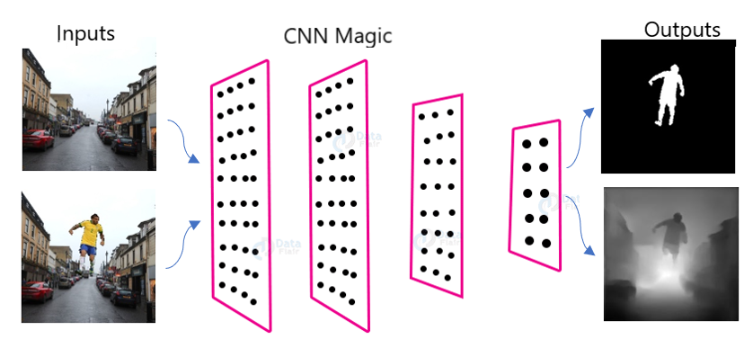

# Mask-and-Depth-Prediction
The problem comes under the domain of single class semantic segmentation (mask) and supervised depth estimation (depth). Here, I present my entire journey of how I approached the problem, starting from the data creation. 

I will explain every thing in detail but let's look at the results first:

## Dataset
The one used in the project is a custom dataset. Please refer <a href = 'https://github.com/akshatjaipuria/Mask-and-Depth-Prediction/tree/master/data#about-the-data'>`this`</a> for details regarding the data creation.
Some of the samples from the dataset:
> bg

> fg

> fg_mask

> fg_bg

> fg_bg_mask

> fg_bg_depth


## What am I supposed to end up with?
My model is supposed to take two images, backgroung(bg) and fg_bg, as inputs at once. The output should be the mask, which is the segmented footballer in the fg_bg and the depth map of the fg_bg. The images are of dimension 224x224, both for imputs and outputs.



We will unveil the magic slowly.

## Data Loader
The very first step is how we load data to train the model. Since it's a custom dataset, the dataloder had to be written according to my folder structure. The images that are to be loaded include bg, fg_bg, mask and depths. This <a href="https://github.com/akshatjaipuria/Mask-and-Depth-Prediction/blob/master/model/data_loader.py" target="_blank">`File`</a> can be referred for the code.

On a brief note, I use the PIL library to load the images. We have 100 bg, 400k fg_bg, 400k masks and 400k depth. Onle one bg images corresponds to 4000 images from each of the other categories. Instead of making copies of bg, I decided to play with the index to make that work with 100 images only 😆. The images are in such order that fg_bg, mask and depth from index 0-3999, 4000-7999, 8000-11999 ... correspond to bg at index 0, 1, 2, ... The simple solution is to chnage the bg index as:
```Python
bg_index = int(index / 4000)
```
#### Train set and Validation set
-Training size: 70% of 400k, i.e. 280k
-Validation size: 30% of 400k, i.e. 120k

The split is made using simple array slicing (numpy) of the list of paths and seed was set to avoid data mixup in train and validation sets.

To speed up, I used pin memory, num_morkers in dataloader as 4 (this reduced the loading time for each epoch by ~400s on Nvidia P100). Also, to speed up training, I kept the batch size as large as possible, given the GPU capacity.

## Model
Next comes the model architecture. Initially, I built some fully convolutional networks to experiment. Those were the usual linear CNN architectures, with the sequence of Conv, BN, ReLU repeatedly with some skip connections to get various receptive fields at the end of the model.


But is this the correct way?

Here are some probable issues:
-
